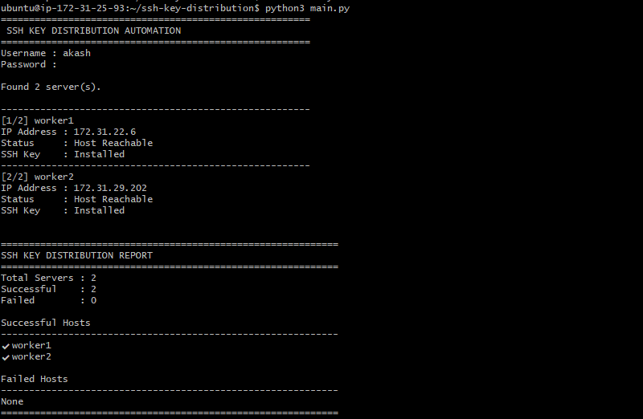

# 🔐 SSH Key Distribution Automation

<p align="center">
  
  
  
  
</p>

<p align="center">
  <b>Automate passwordless SSH authentication across multi-node Linux infrastructure using Python to prepare environments for seamless Ansible orchestration.</b>
</p>

---

## 📌 Overview

Managing SSH access manually across expanding server environments is repetitive, error-prone, and unsustainable at scale. 

This project provides a modular, lightweight Python automation framework that verifies host connectivity, deploys public SSH keys, handles edge-case execution failures gracefully, and generates actionable summary reports. It eliminates manual key management and acts as a foundation for Ansible node onboarding.

### ✨ Key Features

* 📡 **Network Pre-checks:** Automated ICMP/port reachability checks before attempting key copy operations.
* 🔒 **Secure Credentials:** Interactively captures server credentials without storing plaintext passwords using `getpass`.
* 📋 **Batch Processing:** Reads target server metadata directly from structured inventory source files (`inventory.csv`).
* 🛡️ **Resilient Execution:** Catches execution errors per-host without halting the pipeline.
* 📊 **Reporting System:** Terminal-formatted summary breakdown of successful vs. failed operations with failure reasons.
* 🚀 **Ansible Readiness:** Prepares raw Linux hosts for passwordless Ansible playbook deployments.

---

## 🖼️ Architecture & Workflow

```text
               ┌───────────────────────┐
               │  User Inputs & CSV    │
               └──────────┬────────────┘
                          │
                          ▼
               ┌───────────────────────┐
               │ Verify Reachability   │
               └──────────┬────────────┘
                          │
                   Is Host Reachable?
                 ┌────────┴────────┐
                YES               NO
                 │                 │
                 ▼                 ▼
     ┌──────────────────────┐  ┌──────────────────────┐
     │  Deploy SSH Public   │  │  Log Failure Reason  │
     │  Key via Paramiko    │  └──────────────────────┘
     └──────────┬───────────┘
                │
                └─────────┬────────┘
                          │
                          ▼
               ┌───────────────────────┐
               │ Print Summary Report  │
               └──────────┬────────────┘
                          │
                          ▼
             [ Ready for Ansible Control ]

```

---

## 📂 Repository Structure

```text
ssh-key-distribution-automation/
│
├── assets/
│   └── Output.png          # Screenshot of execution output
├── main.py                 # Core application entry point
├── config.py               # Application configuration & default paths
├── ping.py                 # Network reachability verification module
├── ssh_copy.py             # SSH key distribution logic
├── report.py               # Summary report generator module
├── inventory.csv           # Target inventory configuration
├── requirements.txt        # Python dependency manifest              
└── README.md               # Documentation

```

---

## 🛠️ Tech Stack & Prerequisites

### Tech Stack

* **Language:** Python 3.8+
* **Core Libraries:** `paramiko`, `getpass`, `csv`
* **Target OS:** Linux (Ubuntu/Debian, RHEL/CentOS/Rocky), macOS

### Prerequisites

Before running the automation script, ensure your system meets the following requirements:

* **Python 3.8+** and `pip` installed on your control node.
* **OpenSSH Client** installed locally.
* **Network Access:** ICMP (Ping) and TCP port 22 (SSH) allowed from your control machine to target hosts.
* **Valid Local SSH Keypair:** Generate one if you do not already have `~/.ssh/id_rsa.pub` available:
```bash
ssh-keygen -t rsa -b 4096 -f ~/.ssh/id_rsa -N ""

```


---

## ⚙️ Quick Start

### 1. Clone & Set Up Environment

```bash
# Clone repository
git clone [https://github.com/your-username/ssh-key-distribution-automation.git](https://github.com/your-username/ssh-key-distribution-automation.git)
cd ssh-key-distribution-automation

# Create and activate virtual environment
python3 -m venv venv
source venv/bin/activate

# Install dependencies
pip install -r requirements.txt

```

### 2. Configure Target Inventory

Update `inventory.csv` with your target server details:

```csv
hostname,ip
worker1,172.31.22.6
worker2,172.31.29.202

```

### 3. Run Automation

Run the script and provide the initial remote host credentials when prompted:

```bash
python3 main.py

```

---

## 📊 Sample Output

```text

==================================================
           SSH KEY DISTRIBUTION REPORT            
==================================================

SUCCESSFUL DEPLOYMENTS
--------------------------------------------------
[✓] server-web-01 (192.168.1.10) - Key installed successfully
[✓] server-db-01  (192.168.1.20) - Key installed successfully

FAILED DEPLOYMENTS
--------------------------------------------------
[✗] server-app-01 (192.168.1.30) - Host Unreachable (Ping Timeout)

--------------------------------------------------
EXECUTION SUMMARY
--------------------------------------------------
Total Hosts Processed : 3
Successful           : 2
Failed               : 1
==================================================

```
---

## 📊 Execution Output





---

## 💡 Practical Use Cases

* **Cloud VM Onboarding:** Mass-configuring fresh EC2, Compute Engine, or Azure instances after deployment.
* **Ansible Bootstrap:** Setting up passwordless access on targeted nodes before running initial playbooks.
* **DevOps Lab Environment:** Quickly provisioning access controls across heterogeneous Linux lab instances.

---

## 📈 Future Enhancements

* [ ] Add parallel host processing via Python `concurrent.futures`.
* [ ] Support YAML / Dynamic Inventory sources.
* [ ] Add structured log output to disk (`/logs/execution.log`).
* [ ] Generate standard Ansible inventory files (`hosts.ini`) post-successful execution.

---

## 👨‍💻 Author

**Akash M**

*DevOps & Infrastructure Automation*

